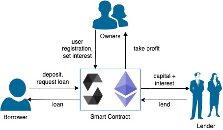
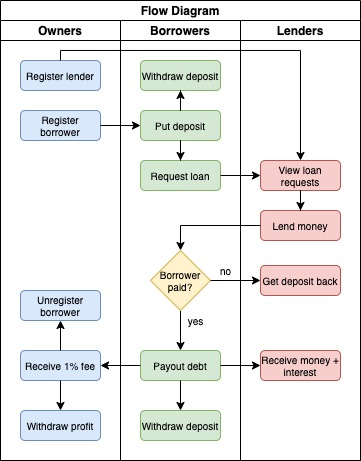
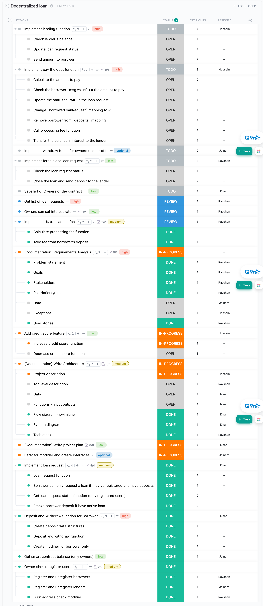
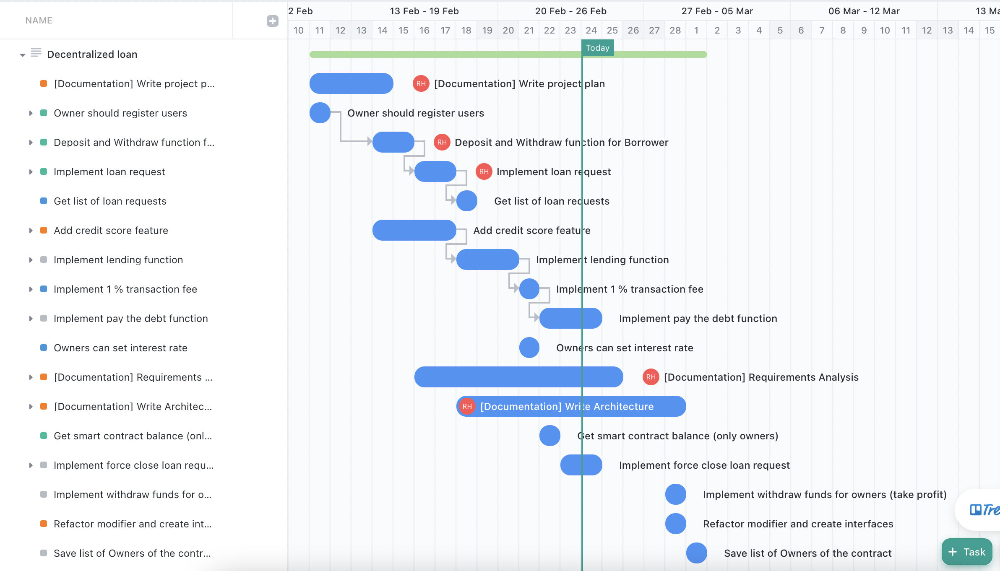

## P2P Lending Smart Contract Solution

### Contributors:

- Ravshan: [LinkedIn](https://www.linkedin.com/in/rmakhmadaliev/) [GitHub](https://github.com/Ravshann)

- Jainam: [LinkedIn](https://www.linkedin.com/in/jainmshah/) [GitHub](https://github.com/naxer-12)

- Hossein: [LinkedIn](https://www.linkedin.com/in/hossein-hesami-5a565b78/) [GitHub](https://github.com/DarioHesami)

- Ramdhani: [LinkedIn](https://www.linkedin.com/in/ramdhaniharis/) [GitHub](https://github.com/rumjuice)

#

## Requirements

### Problem Statement

Traditional banking system usually makes profit sitting between lenders and borrowers. Getting loan from bank is expensive, slow and sometimes impossible(with low credit score).

### Goals

We wanted to solve the issue with blockchain technologies. Our smart-contract based solution on Ethereum blockchain enables parties to lend/borrow money without third-party(banks).

### Stakeholders

There are 3 kinds of actors:

- Borrowers - they borrow money in eth
- Lenders - they lend money in eth
- Smart-contract designers - they take 1%(this may change) profit of lender from successful deal when borrower pays back with interest.

### Restrictions/Rules

Only registered users(borrowers/lenders) can call certain methods. These types of users are registered by owners of smart-contract.

### Data Structures

We used Solidity's built-in `array`, `mapping` and `enum` data structures. In addition, we created a data structure of type `struct` called _LoanRequest_:

```
struct LoanRequest {
    address lender;
    uint256 amount;
    uint8 interestRate;
    uint8 creditScore;
    LoanStatus status;
}
```

### Exceptions

The smart-contract has many exceptions including not only the following(names of exceptions are self-explanatory we hope):

```
NotRegisteredOwner
NotRegisteredBorrower
NotRegisteredLender
DepositCannotBeZero
NotEnoughFunds
NoFundsInDeposit
BurnAddressProhibited
HasActiveLoan
OnlyOwnersAndBorrowersCanAccess
InvalidInterestRate
OnlyOwnersAndLendersCanAccess
```

### User Stories

- Borrowers - borrowers get registered with the help of owners. They will have deposit accounts. Borrowers have limit in amount they can borrow. When borrower borrows money, the user must have 50% of the money in deposit account. This money will be locked until the user pays back the loan with interest. If user does not return money on time, and lender decides to take money, the locked money of borrower will be transferred to lender. A borrower user can deposit ether into their deposit account at any time, any amount. Once the user reaches targeted amount, he/she makes loan request. When loan request is made deposit money is locked. The user may cancel the loan request(locked money is released) and take out money from deposit.
- Lenders - they have access to the list of loan requests. They may choose any loan request they like and fulfill that request. When lender fulfills a request, money will be transferred to smart-contract balance and then from smart-contract balance to borrower balance. This process changes status of loan request and it permanently locks the deposit balance of borrower. Once loan request is fulfilled, borrower can not cancel it and take locked money, instead, borrower is supposed to pay back his/her debt with agreed interest rate.
- Smart-contract designers - there are multiple owner users. Owner type of user can add borrwers, lenders to the system. Call payout method to take profit ethers from smart-contract balance. Profit ethers will be collected from each successfull payback of debt with interest by borrower. For example, a borrower borrowed 2 ethers putting into 1 ether as a warranty deposit for 1 month with 10% interest rate. After a month he returns 2.2 ethers, and gets his deposited 1 ether back. Lender made 0.18 ethers profit(9%), and 0.02 ehthers(1%) goes to smart-contract profit balance.

#

## Architecture

### Project Description

Peer-to-peer (P2P) lending networks consist of two or more computers that interact to communicate, share data, and provide lending services without the need for a central server. The P2P lending networks of yesterday are beginning to integrate with blockchain-based smart contracts, contributing to the evolution of decentralized finance (DeFi). The resulting networks facilitate trustless transactions that lower costs and save time by removing intermediaries. Peer-to-peer lending has become a significant subset of the DeFi ecosystem, and its growth is accelerating.

### Overview

Our smart-contract based solution on Ethereum blockchain enables parties to lend/borrow money without third-party(banks). The system makes profit out of each successful borrow-return process after facilitating simple escrow like service for lenders and borrowers. The decentralized p2p lending system where lender find borrowers and vice-versa. The lender can lend money in form of cryptocurrency especially in ether where borrower can repay after some period of time with interest and smart contract charges 1% fee after being payout for using our service.

### Data

The common datastructure we have used is mapping and struct

Struct

For structures with a size of less than 32 bytes, it is also stored sequentially. For example, the structure variable index is defined at position 0, and there are two members inside the structure, and the order of these two members is 0 and 1.

Mapping

The map storage location is calculated by keccak256 (bytes32(key) + bytes32(position)), and position represents the storage location of the key corresponding to the storage type variable.

### Functions

| index | Functions                                                       | Description                                                                       |
| ----- | --------------------------------------------------------------- | --------------------------------------------------------------------------------- |
| 1     | registerBorrower(address \_newBorrower)                         | owners should register borrowers                                                  |
| 2     | unregisterBorrower(address \_removeBorrower)                    | owners should unregister not needed borrowers                                     |
| 3     | depositMoney()                                                  | Borrowers deposit the money                                                       |
| 4     | getDepositBalance()                                             | Borrowers get deposit balance                                                     |
| 5     | withdrawDeposit()                                               | Borrowers can withdraw deposit balance                                            |
| 6     | requestLoan()                                                   | Requesting the loan and basic struct building                                     |
| 7     | getLoanStatus(address \_borrower)                               | Get the loan status                                                               |
| 8     | balanceOfContract()                                             | Total balance in a contract                                                       |
| 9     | registerLender(address \_newLender)                             | owners should register lenders                                                    |
| 10    | unregisterLender(address \_removeLender)                        | owners should unregister lender                                                   |
| 11    | takeProcessingFee(address \_borrower, uint256 \_borrowedAmount) | take transaction fee which is 1% borrowed amount                                  |
| 12    | findBorrowerAmountInLoanRequests()                              | Finding the borrower amount field in the loan request array through their address |
| 13    | borrowerPaysDebt()                                              | The borrower pays the debt.                                                       |
| 14    | getLoanList()                                                   | owners and lenders can access the loanRequests list                               |
| 15    | setInterestRate(uint8 \_interestRate)                           | owners can set interest rate                                                      |
| 16    | withdrawAll()                                                   | Withdraw smart contract balance                                                   |
| 17    | payout()                                                   | payable method for paying back loan                                                   |
| 18    | forceCloseLoanRequest(address \_borrowerAddress) | by calling this method lender can close the loan transaction and take security deposit of borrower      |
| 19    | lending(uint256 _index) | payable method, lender sends index of loan request in the list and sends necessary amount to fulfill the loan request      |

### System Diagram



### Flow Diagram



### Tech-stack

Smart-contract in Solidity language, Ethereum blockchain

#

## Project Plan

The total time estimate for this project is approximately 2 weeks (17 days)

### Task breakdown

Below is the breakdown of all tasks including the assignment and time estimation for each task.


### Gantt Chart


